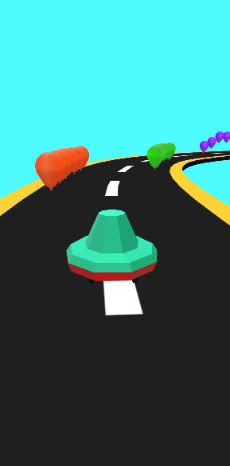
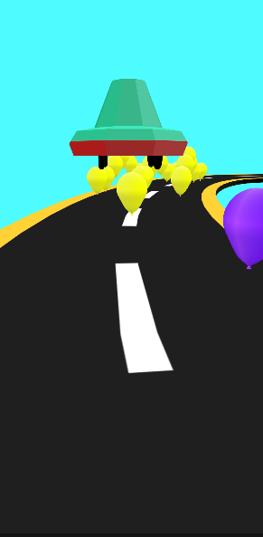

# InfiniteRunner
This is a prototype of an endless runner game. Here the idea is that our player (named Balloon Pinner here) has a neddle mounted on it face which can be used to burst the balloons. 

## Screenshots

## Controls
- Up Arrow to jump
- Right Arrow to move right
- Left Arrow to move left

## References
- **Minimalist Free - Lowpoly Flat/Gradient Shader** https://assetstore.unity.com/packages/vfx/shaders/minimalist-free-lowpoly-flat-gradient-shader-96148, this shader is used to give a Low Poly look to our models making it attractive for mobile games.
- **Bézier Path Creator** https://assetstore.unity.com/packages/tools/utilities/b-zier-path-creator-136082, this asset is used to create a Bezier Path for our player to follow.

## Directions to use
- Just clone the repo and open the projectin Unity 2020b+.
